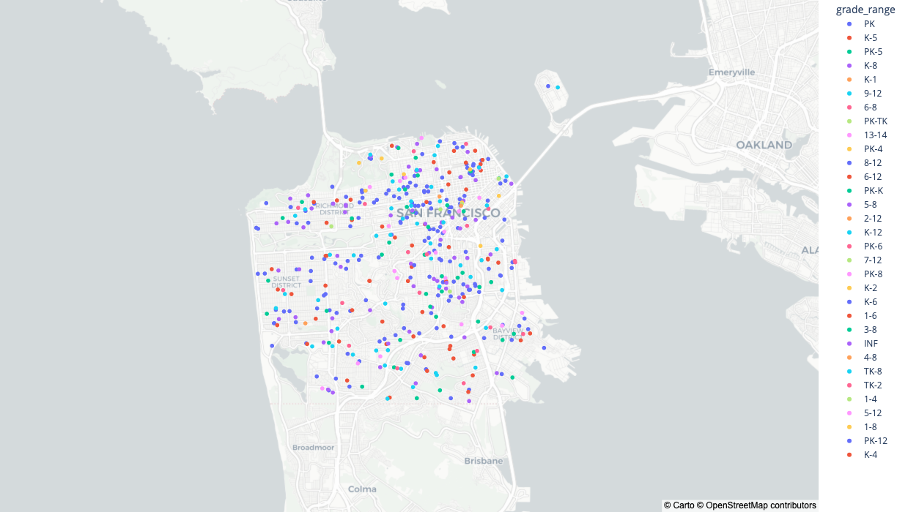

# Project Ideas for Data Collection & Insights

This repository outlines two project ideas focused on leveraging open data and automation to support decision-making around immigration, housing, and education.

---

## 1. Immigration Policy Tracking (State Department)

Built a script that:
- Fetches documents from the **Federal Register API** for the U.S. State Department.
- Filters may be used to focus on other agencies  
- Extracts the **full text** and the **SUPPLEMENTARY INFORMATION** section.  
- Searches across all content for keywords (e.g., *visa types, immigration terms, regions*).  
- Other searches may include a doc number, which if updated in the future allows us to track any new changes or rullings in the future. 
- Saves matched documents with metadata to JSON or a database.  

**Automation:**  
- Can be scheduled with **Apache Airflow** to run at regular intervals.  
- Can also trigger dynamically when new documents matching the keywords are published.  

**Use Case:**  
Helps quickly identify new rules or proposed rules that may affect immigration and visa policies.

---

## 2. Schools & Community Insights

Using open datasets (e.g., SF Gov, SchoolDigger, etc.), we can:  
- Map schools by **location, grade range, and category**.  
- Add filters for **ranking, district, and age group**.  
- Integrate with **housing or crime datasets** for a broader community view.  

**Implementation Options:**  
- Interactive dashboard (e.g., Plotly + Leaflet) for visual exploration.  
- AI-powered recommendation system to suggest neighborhoods based on **school preferences**.  

---

## Example Visualization

  

---

## Next Steps
- Expand keyword sets for immigration tracking.  
- Add additional datasets (housing, crime, demographics).  
- Deploy dashboards for interactive analysis.  
